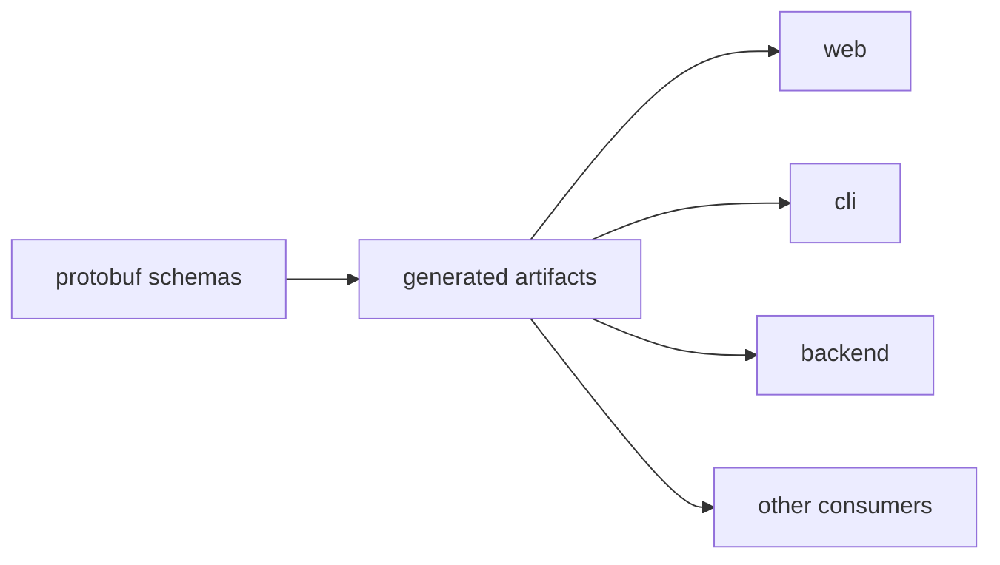
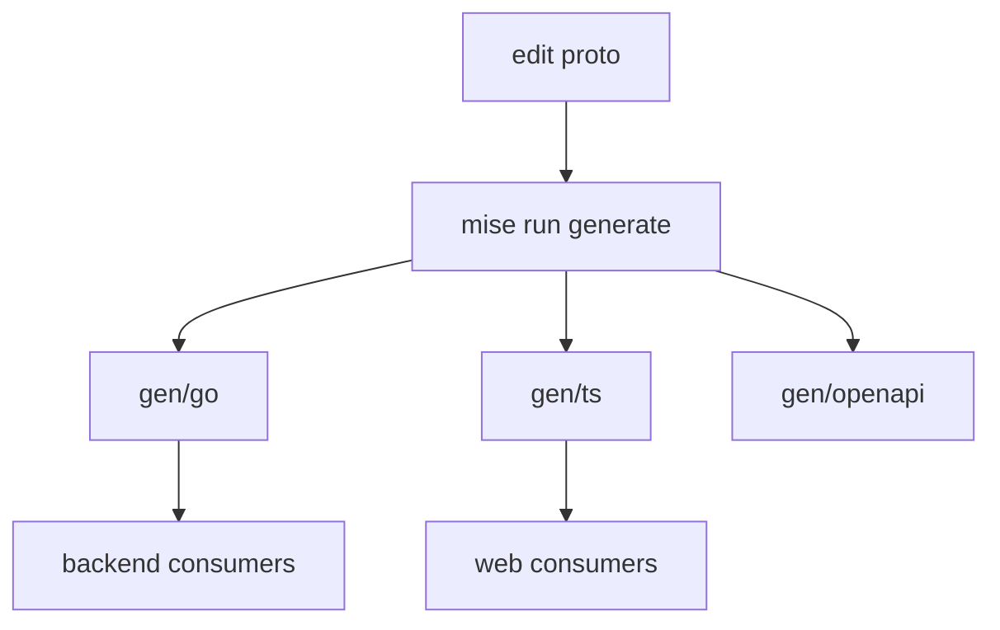

# Architecture

`chill-contracts` turns one protobuf source tree into the artifacts consumed by
the API, web app, CLI, and external clients.

## System Context

## Components

| Path | Owns |
| --- | --- |
| `proto/` | Canonical public API schemas |
| `gen/go/` | Go types and Connect bindings |
| `gen/ts/` | TypeScript types and Connect bindings |
| `gen/openapi/` | OpenAPI output |
| `testdata/consumers/` | Clean Go and TypeScript compile checks |

## Generation Model

## Contract

- This repo owns the public schemas and generated contract artifacts.
- Consumer repos own the behavior built on those contracts.
- Compatibility decisions here are consumer-facing and should be treated like API changes.

## Delivery

Pull requests run `mise run verify`. Merges to `main` are reverified before
semantic-release publishes the npm package and immutable GitHub release. The
release tag is also the Go module version and must resolve under the `/v2`
module path. The release commit is created through GitHub with bot attribution
and verification.
